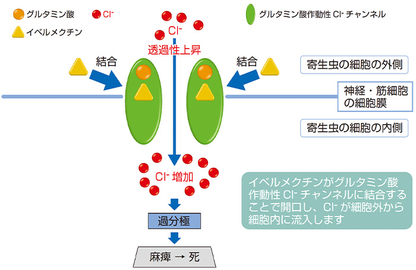

# イベルメクチンは万能薬ではない ─ 検証

## 1. イベルメクチンの歴史と作用機序

イベルメクチンは 1970 年代後半に**北里大学**の大村智（おおむら さとし）特別栄誉教授らの研究で発見された抗寄生虫薬です。寄生虫による失明（河川盲目症）や象皮病などを防ぐ目的でアフリカや中南米を中心に広く使われ、開発途上国で毎年約 3 億人もの人々の命や健康を守ってきました。こうした社会貢献が評価され、**2015 年に大村教授らはノーベル生理学・医学賞を受賞**しています。日本ではイベルメクチン（商品名ストロメクトール）は**腸管糞線虫症**（ちょうかんふんせんちゅうしょう）や**疥癬**（かいせん）といった寄生虫感染症の治療薬として承認されており、寄生虫（線虫やダニ）を死滅させる効果を発揮します。適切な用量で使えば安全性が高く、副作用も比較的少ないことが確認されています。

寄生虫に対する**作用機序（メカニズム）**も科学的に解明されています。イベルメクチンは寄生虫（無脊椎動物）の神経や筋肉の細胞に存在する**グルタミン酸作動性**の**塩化物イオンチャネル**（Cl⁻ チャネル）に選択的かつ高い親和性で結合します。その結果、寄生虫の細胞膜を通して塩化物イオン（Cl⁻）が細胞内に流れ込みやすくなり、神経や筋細胞が過度に**過分極**（かぶんきょく：興奮しにくくなること）してしまいます。この過分極により寄生虫の神経信号伝達が停止して**麻痺**が起こり、やがて寄生虫は死に至ります。

一方でヒトなど脊椎動物には、この種類のグルタミン酸作動性 Cl⁻ チャネルが存在しないため、適切な量のイベルメクチンは寄生虫だけを麻痺させ、人間には強く作用しません。そのため**選択毒性**が高く、寄生虫には劇的に効くのに人には比較的無害という「魔法の弾丸」のような特性を持っています。

出典： ストロメクトールの薬効薬理 | マルホ 医療関係者向けサイト(https://www.maruho.co.jp/medical/articles/stromectol/mechanism/index.html)

_イベルメクチン（黄色の分子）が寄生虫の神経・筋細胞膜にあるグルタミン酸作動性 Cl⁻ チャネル（緑色）に結合し、塩化物イオン（赤い玉）の流入を促進します。その結果、寄生虫の細胞が過剰に「過分極」し、寄生虫は麻痺・死滅します（人間にはこのチャネルが無いため寄生虫のみを攻撃できます）。_

以上のように、イベルメクチンは**寄生虫感染症の特効薬**として歴史的な成功を収めた薬です。しかし、これはあくまで「寄生虫」に対しての効果であり、**がん**や**ウイルス**といった全く性質の異なる病気に対しても同じように効果を発揮するとは限りません。以下、がんやウイルス（ノロウイルス等）に対するイベルメクチンの研究状況と、その「万能薬」という主張がなぜ誤りであるかを、最新の科学的知見にもとづいて見ていきます。

## 2. がんに対するイベルメクチンの効果：研究と現状

「寄生虫を殺す薬」であるイベルメクチンががんにも効くのではないか？――この疑問について、近年いくつかの基礎研究が行われており、興味深い結果が報告されています。このように、既存の薬を別の用途に転用する方法を一般的に **ドラッグ・リポジショニング** と言われています。

ただし前提として重要なのは、その多くが細胞や動物を用いた**実験室レベル**の研究であり、**人間のがん患者さんを治療して効果を確認した臨床研究ではない**という点です。以下に現在までの主な研究例と、その限界について解説します。

まず、大阪大学の研究グループは 2017 年に「イベルメクチンによる**ドラッグ・リポジショニング**（新用途開拓）の可能性」として、卵巣がんモデルを用いた研究成果を発表しました([網羅的遺伝子スクリーニング技術を用いて卵巣がんに対する新規治療標的を発見 - ResOU](https://resou.osaka-u.ac.jp/ja/research/2017/20170919_1#:~:text=%E7%B6%B2%E7%BE%85%E7%9A%84%E9%81%BA%E4%BC%9D%E5%AD%90%E3%82%B9%E3%82%AF%E3%83%AA%E3%83%BC%E3%83%8B%E3%83%B3%E3%82%B0%E6%8A%80%E8%A1%93%E3%82%92%E7%94%A8%E3%81%84%E3%81%A6%E5%8D%B5%E5%B7%A3%E3%81%8C%E3%82%93%E3%81%AB%E5%AF%BE%E3%81%99%E3%82%8B%E6%96%B0%E8%A6%8F%E6%B2%BB%E7%99%82%E6%A8%99%E7%9A%84%E3%82%92%E7%99%BA%E8%A6%8B))。この研究では、マウスの卵巣がんに対して網羅的な遺伝子スクリーニングを行い、**KPNB1**という遺伝子（核内への物質輸送に関与する遺伝子）が治療標的になりうることを発見しました。さらに興味深いことに、**広く安全に使われている抗寄生虫薬イベルメクチンが KPNB1 に依存した抗腫瘍効果を持つ**ことが分かり、既存の抗がん剤パクリタキセルとイベルメクチンを併用するとマウスの腫瘍が著しく縮小する（強い相乗効果が得られる）ことを突き止めたのです。

この成果は、「**既存薬の再利用**」という形でイベルメクチンを卵巣がん治療に役立てられる可能性を示しました。研究者らも「将来、卵巣がんに対する新たな治療戦略となる可能性がある」と期待を述べています。

また、岩手医科大学と北里大学大村智記念研究所の共同研究チームは 2022 年に、イベルメクチンが**ヒトの細胞内**でどの分子に結合して抗がん作用を示すのかを調べ、**TELO2**というタンパク質が重要な標的であることを世界で初めて発見しました ([抗寄生虫薬イベルメクチンによる
抗がん作用を仲介するヒト細胞内標的分子の発見](https://www.kitasato-u.ac.jp/jp/albums/abm.php?f=abm00036973.pdf&n=20220308_%E3%83%97%E3%83%AC%E3%82%B9%E3%83%AA%E3%83%AA%E3%83%BC%E3%82%B9_%E6%8A%97%E5%AF%84%E7%94%9F%E8%99%AB%E8%96%AC%E3%82%A4%E3%83%99%E3%83%AB%E3%83%A1%E3%82%AF%E3%83%81%E3%83%B3%E3%81%AB%E3%82%88%E3%82%8B%E6%8A%97%E3%81%8C%E3%82%93%E4%BD%9C%E7%94%A8%E3%82%92%E4%BB%B2%E4%BB%8B%E3%81%99%E3%82%8B%E3%83%92%E3%83%88%E7%B4%B0%E8%83%9E%E5%86%85%E6%A8%99%E7%9A%84%E5%88%86%E5%AD%90%E3%81%AE%E7%99%BA%E8%A6%8B.pdf#:~:text=%E3%81%A8%E3%81%8C%E8%A8%BC%E6%98%8E%E3%81%95%E3%82%8C%E3%81%BE%E3%81%97%E3%81%9F%E3%80%82%E6%9C%AC%E7%A0%94%E7%A9%B6%E6%88%90%E6%9E%9C%E3%81%AF%E3%80%81%E3%82%A4%E3%83%99%E3%83%AB%E3%83%A1%E3%82%AF%E3%83%81%E3%83%B3%E3%81%AE%E6%94%B9%E8%89%AF%E3%81%AB%E3%82%88%E3%81%A3%E3%81%A6%E6%96%B0%E3%81%9F%E3%81%AA%E6%8A%97%E3%81%8C%E3%82%93%E5%89%A4%E3%81%8C%E9%96%8B%E7%99%BA%E3%81%A7%E3%81%8D%E3%82%8B%E5%8F%AF%E8%83%BD%E6%80%A7%E3%82%92%20%E7%A4%BA%E3%81%99%E3%81%AE%E3%81%A8%E5%90%8C%E6%99%82%E3%81%AB%E3%80%81TELO2%20%E3%81%8C%E6%96%B0%E3%81%9F%E3%81%AA%E5%89%B5%E8%96%AC%E6%A8%99%E7%9A%84%E3%81%AB%E3%81%AA%E3%82%8A%E5%BE%97%E3%82%8B%E3%81%93%E3%81%A8%E3%82%92%E6%98%8E%E3%82%89%E3%81%8B%E3%81%AB%E3%81%97%E3%81%BE%E3%81%97%E3%81%9F%E3%80%82%20%E4%B8%80%E6%96%B9%E3%80%81%E8%A4%87%E6%95%B0%E3%81%AE%E3%82%A4%E3%83%99%E3%83%AB%E3%83%A1%E3%82%AF%E3%83%81%E3%83%B3%E7%B5%90%E5%90%88%E3%82%BF%E3%83%B3%E3%83%91%E3%82%AF%E8%B3%AA%E3%81%AE%E3%81%86%E3%81%A1%E3%80%81importin%20%E3%81%AF%E3%80%81%E6%84%9F%E6%9F%93%E7%B4%B0%E8%83%9E%E4%B8%AD%E3%81%A7%E3%82%A6%E3%82%A4%E3%83%AB%E3%82%B9%E3%81%AE%E5%A2%97%E6%AE%96%E3%81%AB%E5%BF%85%E9%A0%88%E3%81%AE,%E5%BD%B9%E5%89%B2%E3%82%92%E6%8B%85%E3%81%A3%E3%81%A6%E3%81%84%E3%81%BE%E3%81%99%E3%80%82%E3%82%A4%E3%83%99%E3%83%AB%E3%83%A1%E3%82%AF%E3%83%81%E3%83%B3%E3%81%AB%E3%81%AF%E3%80%81%E6%96%B0%E5%9E%8B%E3%82%B3%E3%83%AD%E3%83%8A%E3%82%A6%E3%82%A4%E3%83%AB%E3%82%B9%E6%84%9F%E6%9F%93%E7%97%87%E3%81%AB%E5%AF%BE%E3%81%99%E3%82%8B%E5%8A%B9%E6%9E%9C%E3%82%82%E6%9C%9F%E5%BE%85%E3%81%95%E3%82%8C%E3%81%A6%E3%81%84%E3%81%BE%E3%81%99%E3%80%82%E6%9C%AC))。イベルメクチンが TELO2 に結合すると、細胞の増殖シグナルである**Wnt/β カテニン経路**を阻害し、がん細胞の増殖を抑えることが証明されています。この成果は、現在のイベルメクチンを**化学的に改良**することで新たな抗がん剤を開発できる可能性を示すものであり、同時に TELO2 自体が新しい創薬標的になり得ることも明らかになりました。

こうした研究から、「イベルメクチンには実験的には**抗がん作用**がある」「将来的に抗がん剤として応用できるかもしれない」と期待する声があるのは事実です。実際、他にも海外の研究で**乳がんや卵巣がんの細胞株に対しイベルメクチンが増殖を抑制した**との報告や、「臨床で実行可能な濃度で抗腫瘍効果を示した」として臨床試験（治験）を支持する結果も報告されています ([臨床的に実行可能な濃度でのイベルメクチンの抗腫瘍効果は,再発癌治療薬としての臨床開発を支持する〖JST・京大機械翻訳〗 | 文献情報 | J-GLOBAL 科学技術総合リンクセンター](https://jglobal.jst.go.jp/detail?JGLOBAL_ID=202002228479724555#:~:text=%E8%AB%96%3A%E3%82%A4%E3%83%99%E3%83%AB%E3%83%A1%E3%82%AF%E3%83%81%E3%83%B3%E3%81%AE%E6%8A%97%E8%85%AB%E7%98%8D%E5%8A%B9%E6%9E%9C%E3%81%AB%E9%96%A2%E3%81%99%E3%82%8B%E8%91%97%E8%80%85%E3%82%89%E3%81%AE%E7%B5%90%E6%9E%9C%E3%81%AF%2C%E3%81%9D%E3%81%AE%E8%87%A8%E5%BA%8A%E8%A9%A6%E9%A8%93%E3%82%92%E6%94%AF%E6%8C%81%E3%81%99%E3%82%8B%E3%80%82Copyright%20Springer,%E3%80%96JST%E3%83%BB%E4%BA%AC%E5%A4%A7%E6%A9%9F%E6%A2%B0%E7%BF%BB%E8%A8%B3%E3%80%97))。

しかし、これらはいずれも**培養細胞**や**動物実験**で得られたデータに過ぎません。**実際のがん患者さんにイベルメクチンを投与して腫瘍が縮小した、延命した**といったエビデンスは**現在のところ存在していません**。多少なりとも人でのデータがあるのは一部の少数例や観察研究程度で、**大規模な臨床試験はまだ行われていない**のが現状です。

さらに言えば、仮に実験室レベルで効果が見られても、人の治療に応用するには乗り越えるべき課題があります。例えば「どのくらいの投与量で効果が出るのか」「その高用量でも安全と言えるのか」といった点です。九州大学などの研究では、イベルメクチンは寄生虫治療薬として多くの人に投与され安全性が確立しているものの、**抗がん作用を示す有効濃度はそれより高いため**、安全に抗がん効果を引き出すには工夫が必要だろうと指摘されています ([卵巣がん新治療カギ遺伝子を発見　ノーベル賞の抗寄生虫薬「イベルメクチン」に抗腫瘍効果　阪大](https://www.gsclub.jp/news/3658#:~:text=%E5%8D%B5%E5%B7%A3%E3%81%8C%E3%82%93%E6%96%B0%E6%B2%BB%E7%99%82%E3%82%AB%E3%82%AE%E9%81%BA%E4%BC%9D%E5%AD%90%E3%82%92%E7%99%BA%E8%A6%8B%20%E3%83%8E%E3%83%BC%E3%83%99%E3%83%AB%E8%B3%9E%E3%81%AE%E6%8A%97%E5%AF%84%E7%94%9F%E8%99%AB%E8%96%AC%20,%E3%80%8C%E3%81%8C%E3%82%93%E3%82%B5%E3%83%90%E3%82%A4%E3%83%90%E3%83%BC%E3%82%92%E5%AD%A4%E7%AB%8B%E3%81%95%E3%81%9B%E3%81%AA%E3%81%84%E3%80%8D%E7%A4%BE%E4%BC%9A%E3%82%92%E7%9B%AE%E6%8C%87%E3%81%97%E3%81%A6%E3%80%82%20%E3%81%8C%E3%82%93%E3%82%B5%E3%83%90%E3%82%A4%E3%83%90%E3%83%BC%E3%83%BB))。先述の北里大学の研究のように、分子構造を改良してより強力ながん剤を作る方向性も考えられています。

以上をまとめると：

- **イベルメクチンは現時点で「がんの治療薬」として承認も使用もされていません。** 一部の基礎研究で抗がん作用が示唆され「潜在的な可能性」はありますが、まだ研究段階に留まっています。
- **標準治療（手術・抗がん剤・放射線治療など）の代わりにイベルメクチンを使うようなことは、科学的に根拠がありません。** 実証されていない方法に頼っている間に病状が進行してしまうリスクもあります。
- がん治療は種類ごとに効果的な薬剤や治療法が異なります。仮にイベルメクチンが将来どこかで有効だと証明されるケースが出てきても、それは特定のがん種・条件下での話でしょう。「すべてのがんに効く万能薬」と考えるのは適切ではありません。

現在の医学界の結論としては、「**イベルメクチンはがんに対する万能薬どころか、有効性が証明された治療法ではない**」ということになります。そのため、ネット上で時折見られる「がん患者にイベルメクチンを飲ませれば治る」等の情報には十分注意が必要です。それよりも、がんについては専門医の指導のもと確立された治療を受けることが何より大切です。

## 3. ノロウイルスに対する効果と科学的知見

次に、**ノロウイルス**にイベルメクチンが効くかどうかを見ていきます。ノロウイルスは毎年冬を中心に大流行することがある**ウイルス性胃腸炎**の原因ウイルスです。感染すると 1 ～ 2 日の潜伏期の後に突然の吐き気・嘔吐、下痢、腹痛、発熱といった激しい症状が現れます ([01 「ノロウイルス感染症」のはなし](https://kantoh.johas.go.jp/column/20210416_3.html#:~:text=%E3%83%8E%E3%83%AD%E3%82%A6%E3%82%A4%E3%83%AB%E3%82%B9%E3%81%AB%E6%84%9F%E6%9F%93%E3%81%97%E3%81%A6%E3%82%82%E3%81%99%E3%81%90%E3%81%AB%E7%97%87%E7%8A%B6%E3%81%AF%E5%87%BA%E3%81%BE%E3%81%9B%E3%82%93%E3%80%821%EF%BD%9E2%E6%97%A5%E9%96%93%E3%81%AE%E6%BD%9C%E4%BC%8F%E6%9C%9F%E9%96%93,%E5%90%90%E3%81%8D%E6%B0%97%E3%83%BB%E5%98%94%E5%90%90%E3%80%81%E4%B8%8B%E7%97%A2%E3%80%81%E8%84%B1%E6%B0%B4%E3%81%AA%E3%81%A9%E3%81%AE%E7%97%87%E7%8A%B6%E3%81%AB%E5%AF%BE%E3%81%99%E3%82%8B%E6%B2%BB%E7%99%82%29%E3%81%AE%E3%81%BF%E3%82%92%E8%A1%8C%E3%81%86%E3%81%93%E3%81%A8%E3%81%A8%20%E3%81%AA%E3%82%8A%E3%81%BE%E3%81%99%E3%80%82%E6%B2%BB%E7%99%82%E6%B3%95%E3%81%AF%E5%A4%89%E3%82%8F%E3%82%89%E3%81%AA%E3%81%84%E3%81%9F%E3%82%81%E3%80%81%E7%A2%BA%E5%AE%9A%E8%A8%BA%E6%96%AD%E3%81%AF%E8%A1%8C%E3%81%84%E3%81%BE%E3%81%9B%E3%82%93%E3%80%82%E9%A3%9F%E4%B8%AD%E6%AF%92%E3%80%81%E9%9B%86%E5%9B%A3%E7%99%BA%E7%94%9F%E3%81%AA%E3%81%A9%E3%80%81%E5%8C%BB%E7%99%82%E6%A9%9F%E9%96%A2%E3%81%AB%E3%81%A6%E5%BF%85%E8%A6%81%E3%81%A8%E5%88%A4%E6%96%AD%E3%81%97%E3%81%9F%E5%A0%B4%E5%90%88%E3%81%AB%E3%81%AE%E3%81%BF%E6%96%BD%E8%A1%8C%E3%81%97%E3%81%BE%E3%81%99%E3%80%82%E3%81%AA%E3%81%8A%E3%80%813%E6%AD%B3%E6%9C%AA%E6%BA%80%E3%80%8165%E6%AD%B3%E4%BB%A5%E4%B8%8A%E3%81%AE%E6%96%B9%E3%81%AF%E5%81%A5%20%E5%BA%B7%E4%BF%9D%E9%99%BA%E9%81%A9%E7%94%A8%E3%81%A7%E3%81%99%E3%81%8C%E3%80%81%E9%80%9A%E5%B8%B8%E3%81%AF%E6%99%82%E9%96%93%E5%A4%96%E5%A4%96%E6%9D%A5%E3%80%81%E4%B8%80%E8%88%AC%E5%A4%96%E6%9D%A5%E3%81%A7%E3%81%AF%E6%96%BD%E8%A1%8C%E3%81%97%E3%81%BE%E3%81%9B%E3%82%93%E3%80%82))。多くの場合は**数日で自然に回復**しますが、高齢者や乳幼児では脱水症状に陥る危険があるため油断できません。

**結論から言えば、ノロウイルスそのものを治す特効薬（ウイルスを直接倒す薬）は存在しません。** これはイベルメクチンに限った話ではなく、現代医学においてノロウイルス感染症に有効な抗ウイルス薬はないのです。厚生労働省や医療機関の資料でも「ノロウイルス感染症と診断しても治療法は対症療法のみ」と明記されています ([01 「ノロウイルス感染症」のはなし](https://kantoh.johas.go.jp/column/20210416_3.html#:~:text=%E3%83%8E%E3%83%AD%E3%82%A6%E3%82%A4%E3%83%AB%E3%82%B9%E6%84%9F%E6%9F%93%E7%97%87%E3%81%AF%E3%80%8C%E3%83%8E%E3%83%AD%E3%82%A6%E3%82%A4%E3%83%AB%E3%82%B9%E6%8A%97%E5%8E%9F%E6%A4%9C%E6%9F%BB%E3%80%8D%E3%81%AB%E3%82%88%E3%82%8A%E8%A8%BA%E6%96%AD%E3%81%95%E3%82%8C%E3%81%BE%E3%81%99%E3%81%8C%E3%80%81%E6%9C%89%E5%8A%B9%E3%81%AA%E6%B2%BB%E7%99%82%E8%96%AC,%E5%BA%B7%E4%BF%9D%E9%99%BA%E9%81%A9%E7%94%A8%E3%81%A7%E3%81%99%E3%81%8C%E3%80%81%E9%80%9A%E5%B8%B8%E3%81%AF%E6%99%82%E9%96%93%E5%A4%96%E5%A4%96%E6%9D%A5%E3%80%81%E4%B8%80%E8%88%AC%E5%A4%96%E6%9D%A5%E3%81%A7%E3%81%AF%E6%96%BD%E8%A1%8C%E3%81%97%E3%81%BE%E3%81%9B%E3%82%93%E3%80%82))。対症療法とは、ウイルス自体を排除するのではなく、吐き気止めや解熱剤、点滴などで出ている症状を和らげつつ、患者自身の自然回復力を支える治療です。ノロウイルスの場合、脱水防止のための水分補給が特に重要で、必要に応じて吐き気止めや整腸剤を使います。下痢止め（止瀉薬）はウイルスの排出を妨げてしまうので極力使用しない、というのが医療の現場での基本的な対応です。

ではイベルメクチンはどうかというと、**ノロウイルスに対して有効であるという科学的な報告は一切ありません。** そもそもイベルメクチンがウイルス（ノロウイルスに限らず）に効くという理論的根拠も確立していません。ウイルスは寄生虫とはまったく異なる病原体で、非常に小さく（細菌よりも小さい）、自分自身では増殖できず人の細胞に入り込んで増えます。**寄生虫に有効な薬がウイルスにも効く保証は全くない**のです。実際、イベルメクチンは細菌に対しても効果がありません（細菌には抗生物質が必要で、イベルメクチンと抗生物質では対象が全く異なる）ということが知られています。同じように、ウイルス性の胃腸炎にイベルメクチンを飲んでもウイルス増殖を止める作用は期待できません。

ネット上では「イベルメクチンを飲んだらノロがすぐ治った」という体験談が語られることがあります。しかし、ノロウイルス感染症は上述のように普通でも数日で自然治癒するものです。たまたまイベルメクチンを飲んだタイミングと症状が治まるタイミングが重なっただけ、という可能性が高く、それをもって因果関係（=イベルメクチンのおかげで治った）と判断するのは危険です。現在の医学的エビデンスに照らせば、**ノロウイルスにイベルメクチンは効果なし**と考えるのが妥当です。

## 4. 「万能薬」という誤解とネット上の情報の真偽

イベルメクチンが一部で「**あらゆる病気に効く万能薬**」のように宣伝・信じられてしまっている背景には、いくつかの要因があります。第一に、イベルメクチンが先述の通り寄生虫症に対して極めて顕著な効果を示し、多くの命を救ったことから生まれた「**奇跡の薬**」というイメージです。確かに寄生虫症領域では革命的な薬でしたが、それが**そのまま他の病気にも当てはまるわけではない**ことを忘れてはいけません。

第二に、2020 年前後の新型コロナウイルス感染症（COVID-19）の流行に際し、世界的な社会不安の中でイベルメクチンに注目が集まったことがあります。COVID-19 の有効な治療薬を誰もが求めていた時期に、「試験管内（in vitro）の実験でイベルメクチンが新型コロナウイルスの増殖を抑制した」という趣旨の速報的な論文が登場しました[[1](https://www.ncbi.nlm.nih.gov/pmc/articles/PMC7129059)][[4](https://www.frontiersin.org/articles/10.3389/fpubh.2022.788972/full)]。この論文自体は実験室での結果であり、人に対する効果を証明したものではなかったのですが、SNS や一部メディアで「イベルメクチンはコロナに効くらしい」と一人歩きしてしまいました。さらに、一部の国や地域でイベルメクチンを COVID-19 治療に使ったところ感染者が減った、などという未検証の報告が噂として広がり、「やはり特効薬ではないか」と期待する声が高まったのです。

しかし、その後世界各国で慎重に行われた臨床試験（治験）の結果は、総じてこの期待を裏切るものでした。日本においても、興和株式会社（興和薬品）が主体となって実施した COVID-19 患者に対する最終段階の治験において、**イベルメクチン投与群とプラセボ（偽薬）投与群で症状の改善に差が認められず、有効性を確認できなかった**ことが明らかになっています[[5](https://www.kowa.co.jp/news/2022/press220926.pdf)]。興和は 2022 年 9 月の記者会見で「安全性は確認できたものの、投与群と非投与群の両方で症状が改善したため薬による効果の差が確認できなかった」と発表しています。同様に、北里大学が行った軽症コロナ患者対象の二重盲検試験（2023 年 5 月発表）でも**イベルメクチン投与群とプラセボ群でウイルス陰性化までの時間に差はなく、効果がなかった**と報告されています[[6](https://www.carenet.com/news/general/carenet/56498)]。つまり、臨床試験において適切な方法で試すと「コロナにイベルメクチン」の効果は確認されなかったのです。

こうした結果を受け、現在では世界保健機関（WHO）や米国 FDA、欧州医薬品庁（EMA）などの公的機関、さらには製薬メーカー（イベルメクチンを開発したメルク社）も「COVID-19 の治療や予防にイベルメクチンを使用すべきではない」と明確に勧告しています。実際、米 FDA は公式サイトに「Why You Should Not Use Ivermectin for COVID-19（なぜ COVID-19 にイベルメクチンを使ってはいけないのか）」というページまで設け、承認されていない用途で勝手に使用しないよう警告しています[[8](https://www.fda.gov/safety/medical-product-safety-information/ivermectin-intended-animals-letter-stakeholders-do-not-use-humans-treatment-covid-19)]。日本国内の厚生労働省「新型コロナ診療の手引き」や日本感染症学会のガイドラインにおいても、少なくとも COVID-19 に関してイベルメクチンは推奨される治療ではありません（臨床試験で検証すべき段階のものと位置付けられています） ([[PDF] 〈総 説〉 イベルメクチンの COVID-19 に対する臨床試験の世界的動向](https://www.antibiotics.or.jp/wp-content/uploads/74-1_1-43.pdf#:~:text=%5BPDF%5D%20%E3%80%88%E7%B7%8F%20%E8%AA%AC%E3%80%89%20%E3%82%A4%E3%83%99%E3%83%AB%E3%83%A1%E3%82%AF%E3%83%81%E3%83%B3%E3%81%AECOVID,19))。

さらに、COVID-19 以外の一般的なウイルス感染症（インフルエンザやノロウイルスなど）についても、イベルメクチンの有効性を示した信頼できるデータはありません。仮に「○○ というウイルスにも試験管レベルでは効いた」という報告があったとしても、それを**実際の患者さんで再現できるとは限らない**のです。典型的なのが**投与量の問題**です。試験管内でウイルス増殖を抑えるのに必要だったイベルメクチンの濃度は、人間に通常処方する量では到底達成できない高濃度でした ([NIHS 医薬品安全性情報 Vol.19 No.12（2021/06/10）](http://www.nihs.go.jp/dig/sireport/weekly19/12210610.pdf#:~:text=%E3%82%A4%E3%83%99%E3%83%AB%E3%83%A1%E3%82%AF%E3%83%81%E3%83%B3%E3%81%AF%EF%BC%8Cin%20vitro%E3%81%A7%EF%BC%8C%E7%8F%BE%E5%9C%A8%E6%89%BF%E8%AA%8D%E3%81%95%E3%82%8C%E3%81%A6%E3%81%84%E3%82%8B%E7%94%A8%E9%87%8F%E3%81%A7%E3%81%AF%E5%AE%B9%E6%98%93%E3%81%AB%E9%81%94%E6%88%90%E3%81%A7%E3%81%8D%E3%81%AA%E3%81%84%E6%BF%83%E5%BA%A6%E4%B8%8B%E3%81%A7%20SARS))。国立医薬品食品衛生研究所（NIHS）の報告によれば、「イベルメクチンは in vitro で SARS-CoV-2 の複製を阻害するが、それは**現在承認されている用量では容易に達成できない濃度下**でのことだった」とされています。言い換えれば、人間に使える通常の量のイベルメクチンではウイルスには効かない可能性が高いということです。また、「COVID-19 患者への臨床使用を支持するエビデンスは限られている」とも明記されており、現時点でウイルス感染症の治療薬としては根拠不十分であるとの専門家の見解が示されています。

以上のように、イベルメクチンが「ウイルスに効く」「がんに効く」といった主張は、現段階では科学的に支持されていません。確かに試験管内や動物実験では興味深い効果が見られることがありますが、それをもって「万能薬だ！」と結論づけるのは飛躍があります。薬剤というものは効果と同時に副作用リスクも伴うものです。本来の適応症（寄生虫症）で適切に使う限り安全な薬でも、**目的外の使い方**をすれば思わぬ健康被害を招く恐れがあります。

実際、アメリカでは新型コロナに不安を感じた人々が医師の処方なしに動物用イベルメクチン（家畜の寄生虫駆除用の製剤）を入手して自己服用するケースが続出し、**中毒事故が多発**しました。米国オレゴン州の中毒相談センターの報告では、2021 年 8 月だけで 21 件ものイベルメクチン曝露の通報があり、その約 8 割が人間用ではなく**動物用製剤を使用**した例でした。中には**集中治療室（ICU）で治療を受けるほど重篤な中毒症状**を呈した人もおり、症状としては嘔吐・下痢などの消化器症状のほか、**意識の混濁、歩行障害、極度の低血圧や痙攣発作**など神経系・循環器系の異常が報告されています ([新型コロナへのイベルメクチン使用、中毒症状の報告が急増｜医師向け医療ニュースはケアネット](https://www.carenet.com/news/general/carenet/53233#:~:text=1mg%E3%82%92%E9%80%B12%E5%9B%9E%E4%BD%BF%E7%94%A8%E3%81%97%E3%81%A6%E3%81%84%E3%81%9F%E3%80%82))。幸い死亡例はなかったものの、**大量かつ不適切な使用は大きなリスク**を伴うことが明らかになりました。

日本においても「個人輸入」で入手して自己判断でイベルメクチンを服用する人がいるという報道があります。しかし医薬品を自己判断で使用することは非常に危険です。効果が確かでないだけでなく、上記のような副作用リスクもあります。たとえ「飲んだけど副作用はなく安全だったよ」と個人的に感じたとしても、それは効いていないので副作用も出なかっただけの可能性があります。

インターネット上には「イベルメクチンですべて解決！」のような刺激的な情報が飛び交いましたが、その多くは科学的根拠に欠ける断片的・誇張的な内容です。一部の論文結果を都合よく切り取ったものや、データの信頼性に問題があるものも含まれていました。医学の世界では、新しい治療法は必ず厳密な検証を経て効果と安全性が確認されてから実用化されます。イベルメクチンに関して言えば、現時点では「検証したら効果は確認できなかった」という段階であり、「やはり効かなかった」と結論付けるための十分な証拠が集まったと言えます。

「万能薬」というのは魅力的な響きですが、残念ながら**そんな夢のような薬は存在しない**のが現実です。病気ごとに原因もメカニズムも異なる以上、一つの薬で何もかも治せるはずがないのです。イベルメクチンは素晴らしい薬ですが、それは**適切な対象（寄生虫）に対して用いた場合に限られる**ということを改めて強調したいと思います。

## まとめ

上記の内容を踏まえ、イベルメクチンの適応とエビデンスを簡単に比較します。以下の表は、イベルメクチンが**有効なことが確立されている領域**と、**有効性が確認されていない（あるいは疑わしい）領域**を対比したものです。

| 対象疾患・用途                                                                       | イベルメクチンの有効性       | 解説                                                                                                         |
| ------------------------------------------------------------------------------------ | ---------------------------- | ------------------------------------------------------------------------------------------------------------ |
| **寄生虫感染症** （オンコセルカ症、リンパ系フィラリア症、腸管糞線虫症、疥癬など） | **有効性確立**（第一選択薬） | 寄生虫の神経・筋を麻痺させて駆除する効果があり、公衆衛生への貢献も大きい。適切な用量で安全に使用可能。       |
| がん治療                                                                             | 未確立（研究段階）           | 細胞や動物実験で効果の報告はあるが、ヒトでの有効性は証明されていない。未承認。                               |
| 新型コロナウイルス （COVID-19）                                                   | 無効                         | 試験管レベルでは効果報告もあるが、臨床試験では有効性が確認されず、大規模治験でも効果なし。推奨されていない。 |
| ノロウイルス等の一般ウイルス                                                         | 無効                         | そもそも研究例が少なく、効果を示す根拠もない。一般的に対症療法と予防が基本。                                 |

このように、イベルメクチンは決して「あらゆる病気に効く万能薬」ではありません。その主な活躍の場は**寄生虫による病気**であり、それ以外の用途については**科学的に効果が示されていない**のです。特に、がんやウイルス感染症に関しては、信頼できる専門機関や学会が「現時点で有効とは言えない」「使用は推奨されない」とする明確な声明を出しています([NIHS 医薬品安全性情報 Vol.19 No.12（2021/06/10）](http://www.nihs.go.jp/dig/sireport/weekly19/12210610.pdf#:~:text=%E3%82%A4%E3%83%99%E3%83%AB%E3%83%A1%E3%82%AF%E3%83%81%E3%83%B3%E3%81%AF%EF%BC%8Cin%20vitro%E3%81%A7%EF%BC%8C%E7%8F%BE%E5%9C%A8%E6%89%BF%E8%AA%8D%E3%81%95%E3%82%8C%E3%81%A6%E3%81%84%E3%82%8B%E7%94%A8%E9%87%8F%E3%81%A7%E3%81%AF%E5%AE%B9%E6%98%93%E3%81%AB%E9%81%94%E6%88%90%E3%81%A7%E3%81%8D%E3%81%AA%E3%81%84%E6%BF%83%E5%BA%A6%E4%B8%8B%E3%81%A7%20SARS))。

本レポートで引用したように、厚生労働省や国立研究機関、大学の研究グループ、医療専門家たちはそろって「イベルメクチンは万能薬ではない」という結論に達しています。その背景には慎重に積み重ねられたデータと検証があります。

### 参考文献

1. **厚生労働省**  
   　「新型コロナウイルスに関する Q&A（医療機関・検査機関の方向け）」  
   　https://www.mhlw.go.jp/stf/seisakunitsuite/bunya/kenkou_iryou/dengue_fever_qa_00004.html

2. **国立医薬品食品衛生研究所（NIHS）**  
   　「医薬品安全性情報 Vol.19 No.12（2021 年 6 月 10 日）」  
   　http://www.nihs.go.jp/dig/sireport/weekly19/12210610.pdf

3. **関東労災病院**  
   　「ノロウイルス感染症のはなし」  
   　https://kantoh.johas.go.jp/column/20210416_3.html

4. **北里大学・岩手医科大学 プレスリリース**  
   　「抗寄生虫薬イベルメクチンによる抗がん作用を仲介するヒト細胞内標的分子の発見」  
   　https://www.iwate-med.ac.jp/wp/wp-content/uploads/2d8d3cc02bc80e2e6198d34096190555.pdf

5. **大阪大学 研究成果報告**  
   　「網羅的遺伝子スクリーニング技術を用いて卵巣がんに対する新規治療標的を発見」  
   　https://resou.osaka-u.ac.jp/ja/research/2017/20170919_1

6. **興和株式会社（治験結果）／テレビ朝日 報道**  
   　「抗寄生虫薬イベルメクチン コロナ患者への有効性確認できず」  
   　https://news.tv-asahi.co.jp/news_economy/articles/000269729.html

7. **CareNet 医療ニュース（NEJM 中毒事例）**  
   　「新型コロナへのイベルメクチン使用、中毒症状の報告が急増」  
   　https://www.carenet.com/news/general/carenet/53233

8. **U.S. National Library of Medicine / National Institutes of Health (NIH)**  
   　"COVID-19 and its Treatments: In Vitro and In Vivo Studies of Ivermectin"  
   　https://www.ncbi.nlm.nih.gov/pmc/articles/PMC7129059

9. **現代ビジネス**  
   　「なぜ医師たちは“イベルメクチン推し”になったのか」  
   　https://gendai.media/articles/-/93745

10. **Frontiers in Public Health**  
    　"A Meta-analysis of Randomized Trials of Ivermectin to Treat SARS-CoV-2 Infection"  
    　https://www.frontiersin.org/articles/10.3389/fpubh.2022.788972/full
