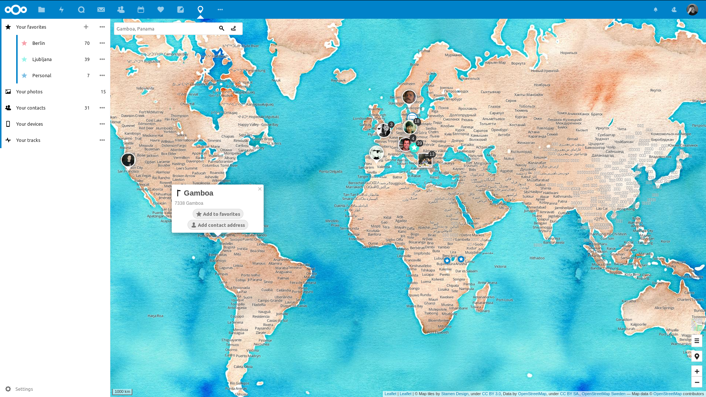

# Nextcloud Maps

**With MapLibre-GL support**

**🌍🌏🌎 The whole world fits inside your cloud!**

- **🗺 Beautiful map:** Using [OpenStreetMap](https://www.openstreetmap.org) and [Leaflet](https://leafletjs.com), you can choose between standard map, satellite, topographical, dark mode or even watercolor! 🎨
- **⭐ Favorites:** Save your favorite places, privately! Sync with [GNOME Maps](https://github.com/nextcloud/maps/issues/30) and mobile apps is planned.
- **🧭 Routing:** Possible using either [OSRM](http://project-osrm.org), [GraphHopper](https://www.graphhopper.com) or [Mapbox](https://www.mapbox.com).
- **🖼 Photos on the map:** No more boring slideshows, just show directly where you were!
- **🙋 Contacts on the map:** See where your friends live and plan your next visit.
- **📱 Devices:** Lost your phone? Check the map!
- **〰 Tracks:** Load GPS tracks or past trips. Recording with [PhoneTrack](https://f-droid.org/en/packages/net.eneiluj.nextcloud.phonetrack/) or [OwnTracks](https://owntracks.org) is planned.

Future plans:
- **📆 Events on the map:** Know where you need to go next!
- **🗺 Different projections:** The [Mercator projection](https://en.wikipedia.org/wiki/Mercator_projection) is very biased, as you can see from [The True Size of Africa](http://kai.sub.blue/en/africa.html). Another view like the [Gall-Peters projection](https://en.wikipedia.org/wiki/Gall%E2%80%93Peters_projection) would be a possibility.

## User Documentation
### My Maps
Custom maps are stored by default in the "/Maps" folder. This folder can be found in the
files app. Other folders turned into map by placing a ".index.maps" file into it.
Content can therefore be added via:
 - Webdav (Desktop and Mobile clients)
 - Files app
 - Maps app

Custom maps can then be shared from the maps or any other app.

#### Sharing map
Maps can be shared using the nextcloud sharing system.

#### Favorites on custom map
Favorites on custom the custom maps are stored in the .favorites.json file.

Shared favorite categories can be linked to a custom map.
Linked favorite categories are read-only.
They can be edited on the owners default map.
These links are stored in the ".favorite_shares.json".

#### Contacts on custom map
Contacts on custom maps are stored as vCards (*.vfc) files.

#### Tracks on custom map
Tracks on custom map are stored as "*.gpx files".

#### Photos on custom map
Photos are stored in the corresponding folder.
They can be added from files

or from maps

Existing photo albums can be viewed
on the map by placing a ".index.maps" file into it.

Scanning photos take time. Therefore photos are scanned in the background.
After adding photos it might take a while,
until the scan is done and the photos are shown on the map.

## 🏗 Development setup

This requires that you [install node and npm](https://www.npmjs.com/get-npm).

1. ☁ Clone this app into the `apps` folder of your Nextcloud: `git clone https://github.com/nextcloud/maps.git`
2. 👩‍💻 In the folder of the app, run the command `make` to install dependencies and build the Javascript.
3. ✅ Enable the app through the app management of your Nextcloud
4. 🎉 Partytime! Help fix [some issues](https://github.com/nextcloud/maps/issues) and [review pull requests](https://github.com/nextcloud/maps/pulls) 👍

## Admin documentation

Media scans are performed with the regular system background job.

Scans can also be manually triggered via occ command:

`./occ maps:scan-photos` to rescan photos' GPS exif data

`./occ maps:scan-tracks` to rescan track files
